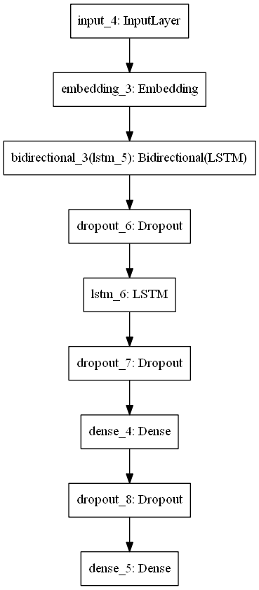

Title : To predict emotion 

Description : The objective of this project to model customer's review. The strategy to win customer support in 21st century was change. 

Result 

# Sentiment Analysis
 Trained with over 60000 IMDB dataset to categorize positive and negative

## To include images

## To include ur link
https://www.google.com
